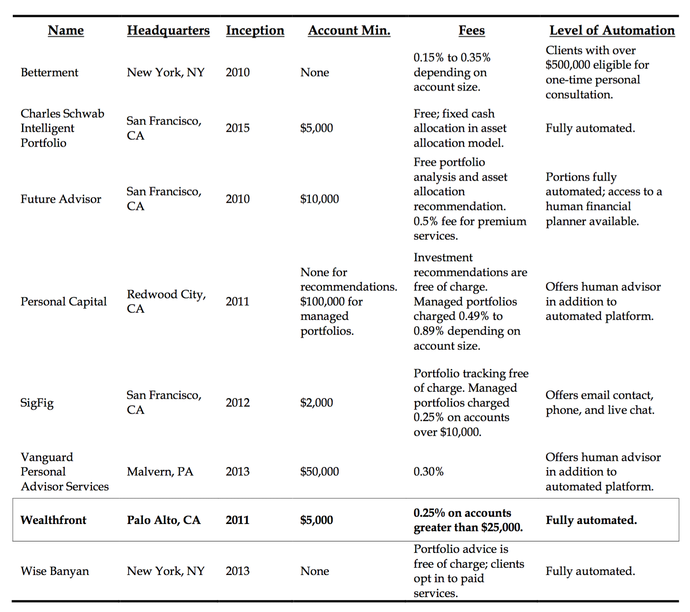

# Wealthfront: A New Fronteir in Wealth Management? 

## Overview and Origin:

 Wealthfront is a fully automated, low-cost,  investment services company that provides a diversified portfolio of financial planning and investment products. The company was founded in 20011 by Dan Carroll and Andy Rachleff. Wealthfront’s investment platform primarily targets the millennial generation, which constitutes roughly 90 million Americans. The user-friendly platform caters to the individual investor’s investment style by assessing their risk tolerance, and then offering them the best-suited portfolio of diversified index funds. In addition, the company continuously monitors the investment practices of the investors, and implements best practices such as portfolio rebalancing, tax-loss harvesting, and dividend reinvestment.

The idea for developing Wealthfront itself came about from both Carroll and Rachleff’s strong resentment towards the injustice that was carried out in the world of wealth management. The everyday investor had limited access to sophisticated investment management services. If investors could get a hold of such a service, it usually came with very expensive fees, and/or high minimum account size requirements. Rachleff was both a Stanford business school lecturer and a seasoned Silicon Valley-based venture capitalist. Having had the opportunity to work with highly qualified investment managers both as the vice chairman of UPenn’s Endowment investment Committee and as a direct investor, Rachleff recalled that ”It bothered me that most people don’t have access to outstanding investment managers. I realized I could do a social good by solving that problem”. Carol, who is a former Chicago-based financial data provider employee and bond trader, was infatuated with his parents' poorly managed, high fee incurring investment accounts. As he reflected, “ I realized that what happened to my parents was probably just a small example of what was going on everywhere. I wanted to find a way to help people like my parents manage their investments.” 

Before coming together to build Wealthfront, both Carrol and Rachleff operated their own financial services, both aimed at providing affordable high-quality investment management to the everyday investor. But It wasn’t until a recommendation made by one of Rachleff’s former students, who was familiar with Carroll’s efforts, did Rachleff decide to meet Carroll in person and join forces. Their first venture into the realm of FinTech started in 2008 with their company kaChing; an online market-place for high-performing equity managers. The venture proved to show promising results for the future of automated management, as the use of cutting-edge software and automation showed promising results and strengthened their vision of a high-quality, low cost investment service. In addition, kaChings clients complained that they would much rather have their entire portfolio managed adequately and inexpensively instead of having only a portion of their portfolio managed superbly. With their strengthened vision and newfound learnings, Rachleff and Carroll launched Wealthfront in 2011. 

 During its early days, Wealthfront primarily relied on private investors and venture capital firms for it’s funding. Doug Mackenzie, a retired Kleiner Perkins Caufield & Byers partner, was one of Wealthfront's earliest investors. He was also the one who advised Rachleff and Carroll to pursue the millennial demographic, as they would care more about the quality and transparency of the user experience, as opposed to the total AUM. Overtime, Wealthfront secured funding from many notable venture capital firms such as Spark Capital, Index Ventures, Greylock partners and various angel investors. Funding from private investors came from notable Silicon Valley tycoons such as Barry Mcarthy, Jeff Weiner, and Satya Patel amongst many others. According to Crunchbase, Wealthfront raised roughly $204.5 million in funding over 6 rounds, with their latest funding being raised on January 4, 2018 from a series E round.

## Business Activities:

At its core, Wealthfront has its company values cemented on the grounds of convenience, web and/or software based experiences, low-priced accessibility, and transparency. The focus put on these core components has helped Wealthfront to really set themselves apart from incumbent firms, and thrive in the realm of wealth management. The very idea of Wealthfront came about from a frustration towards the highly opaque nature of the incumbent wealth management ecosystem: regular investors lacked sufficient access to quality investment management services, minimum account sizes were very high, and management fees were disquieting. The founders were able to leverage the existing market problem by focusing his business strategies towards targeting millennials. The opportunity was created due to two major demographic shifts happening in the U.S. The millennial generation (those born between 1980 and 2000) were coming into adulthood, and the baby boomer generation (those born between 1946 and 1964) were going into retirement. Adam Nash, who is now ex-CEO of Wealthfront, had the foresight that well established brokerage houses such as Charles Scwabb and Meryll Lynch were exhausting their effort on servicing the baby-boomer generation (which controlled roughly $16 trillion worth of assets) and overlooked the millennial generation (which controlled roughly $1 trillion-$2 trillion in assets). This lack of attention to millennials presented a great opportunity, as Nash believed that the total assets controlled by millennials would increase to $7 trillion by 2020 through income generation and inheritance. 

Wealthfront divides the investing public into two primary groups: the “delegators” (those who preferred to involve a third-party or intermediary to take care of their investment goals), and the “do-it-yourselfers” (those who enjoyed managing their assets by themselves. The split amongst the investors were three quarters delegators, and one quarter do-it-yourselfers, and the majority of the millennials fell towards the “delegators” category. Wealthfront’s business model took influence from the “freemium” business model adopted by many tech firms such as Dropbox and Google Cloud: customers were offered basic services for free, and charged clients a fee for more premium services. Wealthfront manages the client's initial $25,000 for free, and offers to manage an additional $5000 in assets for every referred client. Clients are charged a very reasonable fee of 0.25% for any excess amount of assets managed for free, which is considerably lower than the 1% or more charged by traditional managers. Wealthfront utilizes programming tools such as JavaScript, React, Java, Amazon CloudFront, Google Cloud Platform, C++, Kotlin, D3.js, Google Analytics, Twilio SEndGrid, Cmake, G Suite, and Zendesk to develop an automated service that is efficient, reliable and low-cost. These software based solutions allowed Wealthfront to significantly lower their marginal costs, thus setting themselves apart from incumbent giants and winning over the millennial generation. 

## Landscape:

Wealthfront operates in the financial domain of wealth management. This domain of finance is concerned with optimized financial planning and financial services that aims towards sustaining or improving the long-term growth of the financial client. It is concerned with the dimension of finance that combines investment advisory with many other financial services such as private banking, investment planning, and legal/estate planning to serve the needs of affluent clients. The respective advisor analyzes the information presented by the client’s needs. The advisor then creates a tailored strategy to reach the client’s goals by using necessary financial products and services, including but not limited to, Investment Banking, Trading and Principal investments, asset management, and more.

Traditionally, wealth managers have earned their income through obtaining a certain percentage of fees depending on the assets they have under management (AUM); these fees usually fall around 1% or more. Individuals with higher AUM will be charged a smaller percentage. Wealth managers try to compete for the clients with the most dollar amount of assets to manage, however, wealth management isn’t exclusive to the wealthy/ultra-wealthy; many large financial institutions offer wealth management divisions for the common public. Take for example Goldman Sachs, one of the top investment banks in the world. It was founded in 1869 and has operated for almost 150 years, serving some of the most influential people in the world including heads of states & corporations, millionaires and billionaires. The post-financial crisis had forever changed the regulatory environment for Goldman Sachs and other financial institutions alike. This rendered the need for a more transparent and direct relationship with consumers. When Sachs pivoted from serving the most affluent clients and institutional investors to the common public, a strong need to appeal to the mass demographic of clients appeared. This was seen through their digital banking service, “Marcus,” through which they provided personal loans and high yield savings accounts. The trend of investment banks mimicking commercial banks had started to pick up pace, and this is now evident in almost all aspects of the wealth management scene. Wealth management has readily become more accessible and efficient for the general public. With this increasing trend came the demand for improved efficiency, accessibility, and affordability. This shift has created the need in the market for more cost-effective, efficient services that can be scaled to the mass public. Enter Fintech. 

The new generation of investors (Gen X and Gen Y) want more tailored investment advice, access to a dynamic advisory model, user-friendly digital front end services, democratized investment options, and more hedging towards downside risk. This change has paved the way for "robo-advisors'': firms leveraging client survey data into complex algorithms that produce customized financial plans and asset allocations. These robo-advisors utilize passive indexing strategies that try to efficiently optimize some form of the modern portfolio theory: that is, maximizing expected return based on a given level of market risk. The optimized portfolios offered by robo-advisors can encompass different categories of investment strategies, including tactical strategies mimicking hedge funds, or even socially responsible investing. Financial advisors in the past focused their investment advice on delivering superior returns for their clients. However, since investment advice has now largely become commoditized, there is a strong demand for holistic goals-based advice. In addition to Wealthfront, there are other financial advisory companies such as Personal Capital, M1 finance, Acorns, and Betterment that also leverage technology to offer automated investment services. However, Betterment is the closest competitor to Wealthfront in terms of the automated financial services offered.

## Results:

Wealthfront's unique business model and strategic approach to catering towards the millennial generation has proven to be a very disruptive business strategy. Wealthfront has created a system that allows them to manage money at 1/8th of the cost of traditional investors, offer bespoke investment advice to clients by leveraging software automation, implements best practices such as portfolio rebalancing, tax-loss harvesting, and dividend reinvestment, and has ultimately created a democratized portfolio management service. 

When it comes to analyzing it's key business metrics, Wealthfront emphasizes on the following four metrics: visitor traffic, conversion rate, funding rate, and net deposits per client. Wealthfront's visitor traffic had grown 170% from Jan 2013 to Sept 2014. Customer conversion had increased 78% during the same period, all while increasing net deposit per client and maintaining a high funding rate. As a result, Wealthfront managed to grow it's AUM (Asset Under Management) from $97 million in Jan to $1.5 billion in October in 2014. As of 2020, Wealthfront has $15.85 billion in AUM. 

Compared to its competitors, Wealthfront has positioned itself as the more preferable option amongst small investors with taxable accounts. They have been able to accomplish this by offering the following services:

* Offering a lower minimum account requirement than Personal Capital ($500 vs $100,000 respectively)
* Offers a very low management fee at 0.25% of AUM per year (compared to Betterment's 0.25- 0.4% and Personal Capital's 0.49%)
* Wealthfront supports 529 college savings accounts
* Wealthfront's fully automated financial services 

A more extensive comparison between Wealthfront and competitors within the wealth management domain has been provided below:  

## Recommendations:

If I were to give my personal advice to Wealthfront, I would recommend that they tap into the payments services and remittances domain of the financial industry, and offer a P2P payments service (similar to Venmo) that would cater to the needs of the millennial generation, further strengthening Wealthfront’s relationship with their target audience. Seeing as how Wealthfront has already obtained a substantial following amongst young private investors, they could transfer their current deposit accounts into e-wallets, by which investors would be able to make digital payments via text to other Wealthfront wallet holders. It would be wise for Wealthfront to adopt unique gamification elements and social media elements (similar to Venmo) by which users would be able to interact with other users, thus enhancing the network effect of the payments interface. In doing so, Wealthfront would be able to generate additional revenue (based on volume of transactions), create greater incentive for  their users to make deposits on the Wealthfront platform which would increase Wealthfront’s  AUM, and also give them more investor data points on investor behavior (such as spending habits, preferences, seasonal/occasional factors) to better tailor investment advice for them. Greater synergy would be created for Wealthfront, and the key business metrics would be further enhanced, giving Wealthfront a competitive advantage from all of their competitors. 

In order to integrate such a service, Wealthfront would need to develop their own payments interface. The tools needed to create such an interface would be built on the backbone of Wealthfront's already existing software and data tools. Some of these additional tools would include Ruby, CSS 3, Powershell, Moment.js and many others. All in all, I believe that this idea would prove to be very beneficial for Wealthfront given their unique business model, competitive hold over target audience, and overall goal to create greater value for investors through efficiency, transparency, accessibility, and affordability. 

# Work Cited: 

- https://www2.deloitte.com/content/dam/Deloitte/us/Documents/strategy/us-cons-disruptors-in-wealth-mgmt-final.pdf
- https://blog.wealthfront.com/one-billion-assets-under-management/
- https://investorjunkie.com/compare/wealthfront-vs-personal-capital/
- https://investorjunkie.com/robo-advisors/betterment-vs-wealthfront/
- https://investorjunkie.com/compare/wealthfront-vs-personal-capital/
- https://digital.hbs.edu/platform-rctom/submission/wealthfront-why-automated-advising-and-millennials-were-made-for-each-other/
- https://www.mckinsey.com/business-functions/mckinsey-digital/our-insights/key-trends-in-digital-wealth-management-and-what-to-do-about-them
- https://techcrunch.com/2018/08/15/catching-up-with-startup-advisor-and-wealthfront-ceo-andy-rachcleff/

